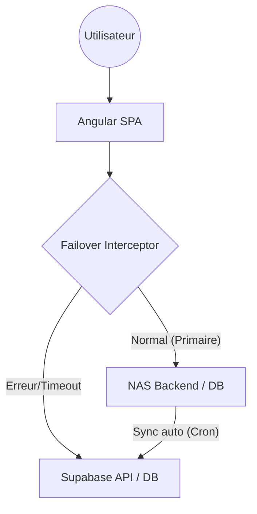

# 📱 Poked'EC — Pokémon GO Community Tool

<div align="center">
  
  <p><i>Gérez votre collection personnelle de Pokémon avec vos amis afin de faciliter les échanges pour compléter vos Pokédex.</i></p>

  []()
  []()
  []()
  []()
</div>

---

## 📖 Sommaire
1. [Présentation](#-présentation)
2. [Fonctionnalités](#-fonctionnalités)
3. [Architecture & Tech Stack](#-architecture--tech-stack)
4. [Installation & Configuration](#-installation--configuration)
5. [Sécurité](#-sécurité)
6. [Documentation Supplémentaire](#-documentation-supplémentaire)
7. [Contribution](#-contribution)
8. [Licence](#-licence)

---

## 📖 Présentation

**Poked'EC** est une application web fullstack conçue pour aider les dresseurs de Pokémon GO à suivre leur Pokédex, leurs variantes (Shiny, Lucky, XXL, etc.) et à organiser des échanges avec d'autres membres de la communauté.

L'application offre une interface intuitive pour marquer les Pokémon capturés dans différentes catégories et permet de visualiser les besoins des autres membres de la communauté pour faciliter les échanges stratégiques.

## 🚀 Fonctionnalités

### 👤 Pour les Dresseurs
- **Pokédex Interactif** : Liste complète des Pokémon avec recherche instantanée et filtres par génération/région.
- **Suivi Précis des Variantes** :
  - ✨ **Shiny** (Chromatiques) & 🍀 **Chanceux** (Lucky)
  - 📏 **XXL / XXS** (Tailles extrêmes)
  - 🧬 **Méga & G-Max**
  - 👻 **Obscures & Purifiés**
  - 💯 **Parfaits** (IV 100%)
- **Gestion des Échanges** : Marquez vos doubles comme "Disponibles à l'échange" et listez vos "Recherchés".
- **Social** : Visualisez les profils des autres dresseurs et leurs listes d'échanges.

### 🛡️ Pour les Administrateurs
- **Gestion des Utilisateurs** : Modération et activation des comptes.
- **Configuration Globale** : Définition des règles de disponibilité des variantes pour chaque Pokémon (ex: "est-ce que ce Pokémon peut être Shiny ?").
- **Import de Données** : Outils pour maintenir la base de données à jour avec les dernières nouveautés de Pokémon GO.

## 🏗️ Architecture & Tech Stack

L'architecture est pensée pour la résilience et la haute disponibilité :

- **Frontend** : [Angular 18](https://angular.io/) (SPA) hébergé sur **Vercel**.
- **PWA & Offline** : Service Worker Angular pour le cache des ressources et des données API (Pokedex, images).
- **Observabilité** : Système de logging robuste avec [Winston](https://github.com/winstonjs/winston) et monitoring des requêtes HTTP avec [Morgan].
- **Failover Intelligent** : Système de basculement automatique entre un serveur primaire (ex: NAS local / Synology) et un serveur de backup cloud (Supabase).
- **Versioning Automatisé** : Gestion automatique des versions et tags Git lors de chaque déploiement.
- **Indicateur Réseau** : Badge visuel dynamique dans l'UI informant de l'état de la connexion (Online / Offline / Backend Issue).

### Flux de données & Failover
(Voir `ARCHITECTURE_OVERVIEW.md` pour plus de détails)



## 🛠️ Installation & Configuration

### Prérequis
- Node.js 18.x ou supérieur
- PostgreSQL (ou compte Supabase)
- Un serveur SMTP pour les emails de vérification

### Installation Locale

1. **Cloner le projet**
   ```bash
   git clone https://github.com/pokedec-admin/PokedEC.git
   cd PokedEC
   ```

2. **Backend**
   ```bash
   cd backend
   npm install
   cp .env.example .env
   # Éditez .env avec vos accès DB et clés secrètes
   npm start
   ```

3. **Frontend**
   ```bash
   cd frontend
   npm install
   npm start
   ```
   L'application sera accessible sur `http://localhost:4200`.

### Déploiement Docker (Optionnel)
Le projet inclut des fichiers `docker-compose.yml` pour un déploiement simplifié via conteneurs.

## 🔐 Sécurité

La sécurité est une priorité du projet. Un audit complet a été réalisé :
- **Protection des Données** : Utilisation de `helmet` pour sécuriser les headers HTTP et de `cors` avec une whitelist stricte.
- **Zéro Secret en Dur** : Toutes les clés d'API (Supabase, Render, JWT) sont gérées via des variables d'environnement.
- **Journalisation Sécurisée** : Les logs techniques sont gérés centralement par Winston, évitant l'exposition d'informations sensibles via `console.log`.
- **Authentification Robuste** : Utilisation de JWT avec une expiration définie et hashage des mots de passe via `bcryptjs`.
- **Validation & Sanity** : Requêtes SQL paramétrées pour prévenir les injections.

## 📂 Documentation Supplémentaire

- 🏗️ **[Architecture Détaillée](./ARCHITECTURE_OVERVIEW.md)** : Fonctionnement du système de basculement.
- ⚙️ **[Configuration](./CONFIGURATION.md)** : Liste détaillée des variables d'environnement.
- 📡 **[Documentation API](./API_DOCUMENTATION.md)** : Endpoints disponibles.
- 👤 **[Guide Utilisateur](./USER_GUIDE.md)** : Comment utiliser l'application au quotidien.
- 🚀 **[Checklist Production](./PRODUCTION_CHECKLIST.md)** : Pour un déploiement réussi.

## 🤝 Contribution

1. Forkez le projet.
2. Créez votre branche (`git checkout -b feature/AmazingFeature`).
3. Commitez vos changements (`git commit -m 'Add some AmazingFeature'`).
4. Pushez vers la branche (`git push origin feature/AmazingFeature`).
5. Ouvrez une Pull Request.

## 📜 Licence

Projet privé — Tous droits réservés.

---
<div align="center">
  Fait avec ❤️ par la communauté Poked'EC
</div>
