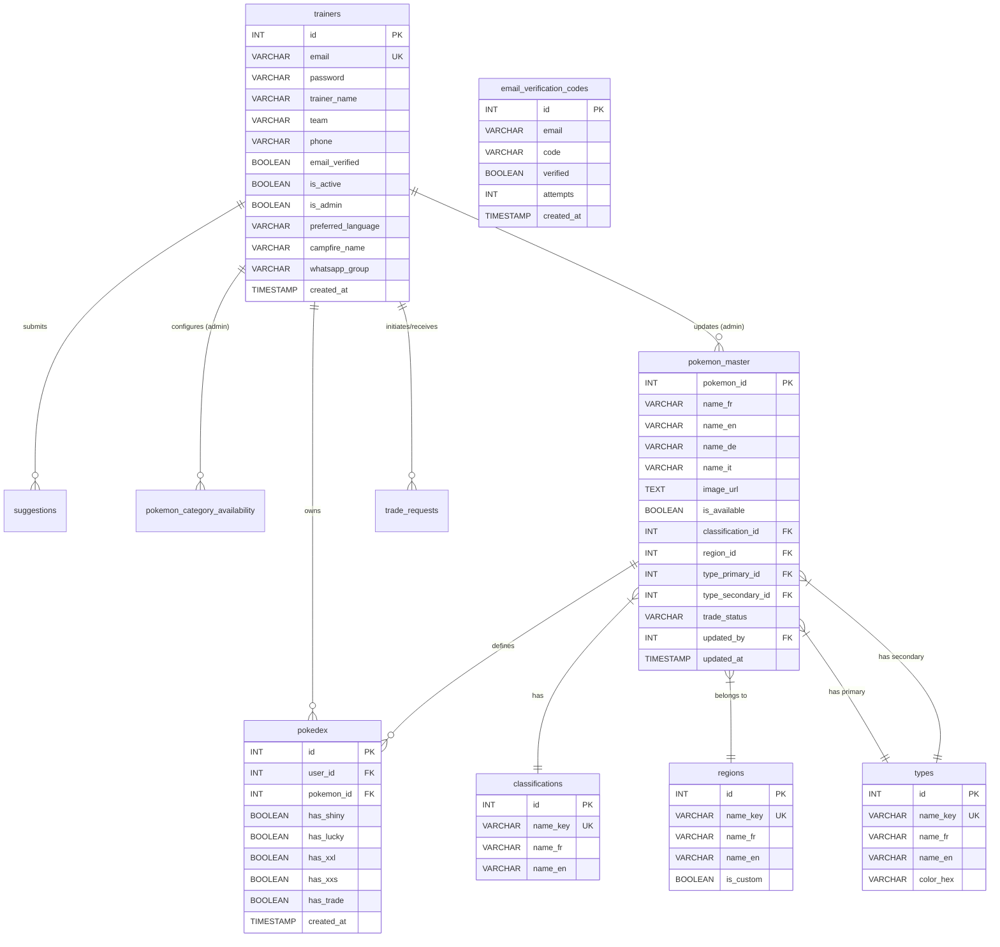

# Database Schema Documentation - ng-PokedEC

## Entity-Relationship Diagram (ERD)

---

## Table Definitions

### 1. Core Tables

#### `trainers`
Trainer accounts and profile information.

| Attribute | Type | Description |
|-----------|------|-------------|
| `id` | `SERIAL` | Primary Key |
| `email` | `VARCHAR(255)` | Unique email address |
| `password` | `VARCHAR(255)` | Hashed password |
| `trainer_name` | `VARCHAR(255)` | Pokemon GO trainer name |
| `team` | `VARCHAR(20)` | Mystic/Valor/Instinct |
| `phone` | `VARCHAR(20)` | Contact phone number |
| `email_verified` | `BOOLEAN` | Email verification status (Default: false) |
| `is_active` | `BOOLEAN` | Account active status (Default: true) |
| `is_admin` | `BOOLEAN` | Admin privileges flag (Default: false) |
| `preferred_language` | `VARCHAR(10)` | UI language (fr/en/de/it) |
| `campfire_name` | `VARCHAR(255)` | Niantic Campfire username |
| `whatsapp_group` | `VARCHAR(255)` | Local community group |
| `created_at` | `TIMESTAMP` | Account creation timestamp |

#### `pokedex`
User's personal Pokemon collection. Links to `pokemon_master` for static data.

**Note:** Names and images are **NOT** stored here - they come from `pokemon_master` via JOIN.

| Attribute | Type | Description |
|-----------|------|-------------|
| `id` | `SERIAL` | Primary Key |
| `user_id` | `INTEGER` | FK to `trainers(id)` |
| `pokemon_id` | `INTEGER` | National Dex ID (FK to `pokemon_master`) |
| `has_shiny` | `BOOLEAN` | Collected shiny variant |
| `has_lucky` | `BOOLEAN` | Collected lucky variant |
| `has_xxl` | `BOOLEAN` | Collected XXL variant |
| `has_xxs` | `BOOLEAN` | Collected XXS variant |
| `has_gmax` | `BOOLEAN` | Collected Gigantamax variant |
| `has_dynamax` | `BOOLEAN` | Collected Dynamax variant |
| `has_mega` | `BOOLEAN` | Collected Mega variant |
| `has_obscure` | `BOOLEAN` | Collected Shadow variant |
| `has_purifie` | `BOOLEAN` | Collected Purified variant |
| `has_parfait` | `BOOLEAN` | Collected Perfect IV variant |
| `has_trade` | `BOOLEAN` | Available for trade (Standard) |
| `trade_shiny` | `BOOLEAN` | Shiny available for trade |
| `trade_xxl` | `BOOLEAN` | XXL available for trade |
| `trade_xxs` | `BOOLEAN` | XXS available for trade |
| `trade_gmax` | `BOOLEAN` | G-MAX available for trade |
| `trade_dynamax` | `BOOLEAN` | Dynamax available for trade |
| `trade_mega` | `BOOLEAN` | Mega available for trade |
| `trade_purified` | `BOOLEAN` | Purified available for trade |
| `trade_legendary` | `BOOLEAN` | Legendary available for trade |
| `trade_mythical` | `BOOLEAN` | Mythical available for trade |
| `trade_ultra_beast` | `BOOLEAN` | Ultra Beast available for trade |
| `created_at` | `TIMESTAMP` | Entry creation timestamp |

### 2. Master Data Tables (New Architecture)

#### `pokemon_master`
Central repository for all Pokemon static data. Source of truth for the application.

| Attribute | Type | Description |
|-----------|------|-------------|
| `pokemon_id` | `INTEGER` | Primary Key (National Dex ID) |
| `name_fr` | `VARCHAR(255)` | French name |
| `name_en` | `VARCHAR(255)` | English name |
| `name_de` | `VARCHAR(255)` | German name |
| `name_it` | `VARCHAR(255)` | Italian name |
| `image_url` | `TEXT` | Official sprite URL |
| `is_available` | `BOOLEAN` | Global visibility flag |
| `classification_id` | `INTEGER` | FK to `classifications(id)` |
| `region_id` | `INTEGER` | FK to `regions(id)` |
| `type_primary_id` | `INTEGER` | FK to `types(id)` |
| `type_secondary_id` | `INTEGER` | FK to `types(id)` (Nullable) |
| `trade_status` | `VARCHAR(20)` | Global trade rule (YES/NO/SPECIAL) |
| `updated_by` | `INTEGER` | Admin who last modified (FK to `trainers`) |
| `updated_at` | `TIMESTAMP` | Last modification time |

#### `classifications`
Pokemon categories (e.g., Starter, Legendary, Mythical).

| Attribute | Type | Description |
|-----------|------|-------------|
| `id` | `SERIAL` | Primary Key |
| `name_key` | `VARCHAR(50)` | Unique key (e.g., 'legendary') |
| `name_fr` | `VARCHAR(50)` | French label |
| `name_en` | `VARCHAR(50)` | English label |
| `display_order` | `INTEGER` | Sorting order |

#### `regions`
Pokemon generations/regions (e.g., Kanto, Johto).

| Attribute | Type | Description |
|-----------|------|-------------|
| `id` | `SERIAL` | Primary Key |
| `name_key` | `VARCHAR(50)` | Unique key (e.g., 'kanto') |
| `name_fr` | `VARCHAR(50)` | French label |
| `name_en` | `VARCHAR(50)` | English label |
| `display_order` | `INTEGER` | Sorting order |
| `is_custom` | `BOOLEAN` | Flag for custom/event regions |

#### `types`
Elemental types (e.g., Fire, Water).

| Attribute | Type | Description |
|-----------|------|-------------|
| `id` | `SERIAL` | Primary Key |
| `name_key` | `VARCHAR(50)` | Unique key (e.g., 'fire') |
| `name_fr` | `VARCHAR(50)` | French label |
| `name_en` | `VARCHAR(50)` | English label |
| `color_hex` | `VARCHAR(7)` | Hex color code for UI badges |

### 3. System Tables

#### `email_verification_codes`
Temporary storage for email verification OTPs.

| Attribute | Type | Description |
|-----------|------|-------------|
| `id` | `SERIAL` | Primary Key |
| `email` | `VARCHAR(255)` | Target email |
| `code` | `VARCHAR(4)` | 4-digit OTP |
| `verified` | `BOOLEAN` | Verification status |
| `attempts` | `INTEGER` | Security counter |
| `created_at` | `TIMESTAMP` | Expiration tracking |

#### `pokemon_category_availability`
Admin configuration for allowed variants per Pokemon (Legacy/Hybrid).

| Attribute | Type | Description |
|-----------|------|-------------|
| `pokemon_id` | `INTEGER` | PK (National Dex ID) |
| `can_be_shiny` | `BOOLEAN` | Shiny variant allowed |
| `can_be_lucky` | `BOOLEAN` | Lucky variant allowed |
| `can_be_xxl` | `BOOLEAN` | XXL variant allowed |
| `can_be_xxs` | `BOOLEAN` | XXS variant allowed |
| `can_be_gmax` | `BOOLEAN` | G-MAX variant allowed |
| `can_be_dynamax` | `BOOLEAN` | Dynamax variant allowed |
| `can_be_mega` | `BOOLEAN` | Mega variant allowed |
| `can_be_obscure` | `BOOLEAN` | Shadow variant allowed |
| `can_be_purified` | `BOOLEAN` | Purified variant allowed |
| `can_be_perfect` | `BOOLEAN` | Perfect IV variant allowed |
| `updated_at` | `TIMESTAMP` | Last update |

#### `suggestions`
Trainer feedback system.

| Attribute | Type | Description |
|-----------|------|-------------|
| `id` | `SERIAL` | Primary Key |
| `user_id` | `INTEGER` | FK to `trainers(id)` |
| `type` | `VARCHAR(50)` | bug/feature/other |
| `content` | `TEXT` | Suggestion details |
| `status` | `VARCHAR(20)` | pending/approved/rejected |
| `admin_response` | `TEXT` | Admin reply |
| `is_read` | `BOOLEAN` | Read status |
| `created_at` | `TIMESTAMP` | Submission time |

#### `trade_requests`
System for managing trade proposals between users.

| Attribute | Type | Description |
|-----------|------|-------------|
| `id` | `SERIAL` | Primary Key |
| `requester_id` | `INTEGER` | User initiating trade (FK) |
| `target_user_id` | `INTEGER` | User receiving request (FK) |
| `pokemon_id` | `INTEGER` | Pokemon requested (FK) |
| `status` | `VARCHAR(20)` | pending/accepted/rejected |
| `created_at` | `TIMESTAMP` | Request time |
| `updated_at` | `TIMESTAMP` | Last status change |
